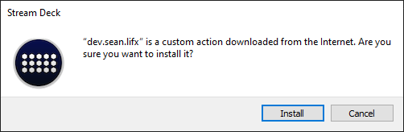
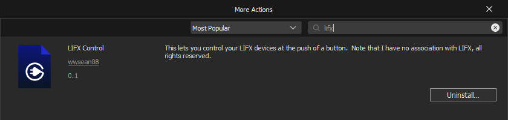

# LIFX Stream Deck

This plugin allows for an Elgato Stream Deck to control LIFX devices at the click of a button.  Currently, it is capable of turning devices on or off, as well as setting the color of the light.

## Contributions
All contributions are welcome, whether it's creating/updating docs, creating issues, requesting new features, or opening pull requests.  Feedback is welcome both via GitLab issues or via discord in the lifx-streamdeck-feedback channel. 

## Installation and Upgrading
### Installing
Installing the application is as simple as downloading the latest version of the application from the [releases page](https://gitlab.com/wwsean08/lifx-streamdeck/-/releases) and then running it and accepting the warning:

### Upgrading
Upgrading requires uninstalling the previous version, don't worry, your settings will be persisted by the Stream Deck.  To uninstall it, go to "More Actions..." in the Stream Deck application, and click Uninstall:

Once you have uninstalled the plugin you can follow the Installation instructions.

## Supported Actions
You can see an overview of the features at https://www.youtube.com/watch?v=PiGfuwZe3Zs

### Setting the devices power state
You are able to turn devices on or off using the respective actions.  Doing this can control more than one device at once

### Toggle the device power state
You can use the toggle action to turn on or off devices depending on its current power state.

### Setting the devices color
You are able to set a device or multiple devices color at the push of a button.  In order to make configuration of the color simpler, you are able to choose a device and copy its current settings and store them as the settings for that action.  You can also leverage this in a multi-action to turn on a device, set it's color, or maybe eve change between a few colors every couple seconds for a short period of time.

### Setting the brightness independent of color
You can change the device's brightness independent of its current color (as brightness is one of the arguments of setting a color).

### Setting the wave effect
You can setup a "wave" effect where your button press causes the device to go between two colors over time.  For more information on how the settings work I recommend reading LIFX's [official documentation](https://lan.developer.lifx.com/docs/waveforms).

## Known Issues
1. Sometimes the device mac address is shown instead of the devices label, if the devices label isn't returned in time then the mac address will be shown as opposed to nothing.
