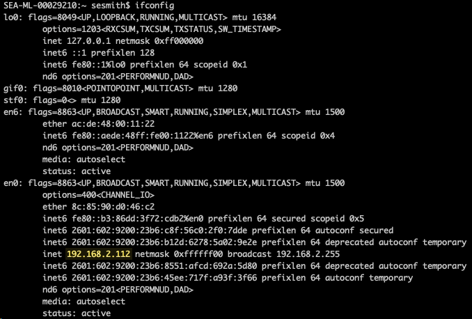
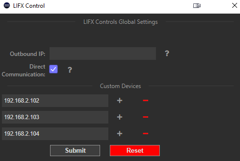

# Outbound IP

Most users don't need to set the Outbound IP address, and can leave it blank which auto-discovers the IP address to use.  If you are using a VPN or have multiple network adapters/networks (for example a work network and personal network) on your computer then the auto-discovery may choose the wrong network adapter.

## Getting your LIFX Devices IP Address
Many routers offer the ability to get the device list, it might be under a page like "attached devices" or "connected devices" for example below is my LIFX Beam named Beam on the page with the IP Address of `192.168.2.102`

## Windows
On Windows open command prompt by hitting start and typing in `cmd` once that loads, run `ipconfig`

Based on the screenshot above I would enter `192.168.2.124` into the Outbound IP box as the first 3 numbers match with my LIFX Bulb, which would cause it to use this network adapter to manage the devices.
## Mac
On mac open your `terminal` application then run the `ifconfig` command

Based on the screenshot above I would enter `192.168.2.122` into the Outbound IP box as the first 3 numbers match with my LIFX Bulb, which would cause it to use this network adapter to manage the devices.

# Direct Communication

This is a setting that usually doesn't need to be changed which makes it so that all requests are sent to your devices directly instead of using broadcasts.  With this enabled if the IP address of your devices change, you will need to perform a rediscovery.

This setting is required when configuring custom devices.

# Custom Devices

**Requires Direct Communication**

In the case where devices are not discovered via broadcast (the normal method), you can add the IP addresses to the global settings, and discovery will be attempted by contacting those devices directly.  Note that for this to work, the devices need to be able to open new connections to your PC, if a firewall prevents that, discovery will never work.  Below is an example screenshot of how it might look:

