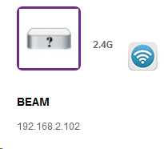
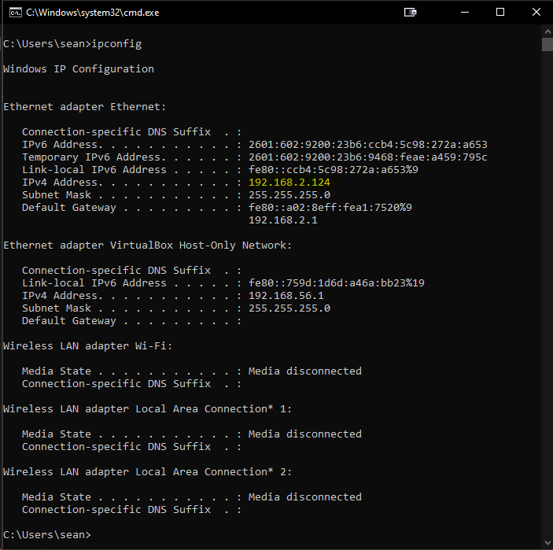

# Outbound IP

Most users don't need to set the Outbound IP address, and can leave it blank which auto-discovers the IP address to use.  If you are using a VPN or have multiple network adapters/networks (for example a work network and personal network) on your computer then the auto-discovery may choose the wrong network adapter.

## Getting your LIFX Devices IP Address
Many routers offer the ability to get the device list, it might be under a page like "attached devices" or "connected devices" for example below is my LIFX Beam named Beam on the page with the IP Address of `192.168.2.102`

## Windows
On Windows open command prompt by hitting start and typing in `cmd` once that loads, run `ipconfig`

Based on the screenshot above I would enter `192.168.2.124` into the Outbound IP box as the first 3 numbers match with my LIFX Bulb, which would cause it to use this network adapter to manage the devices.
## Mac

